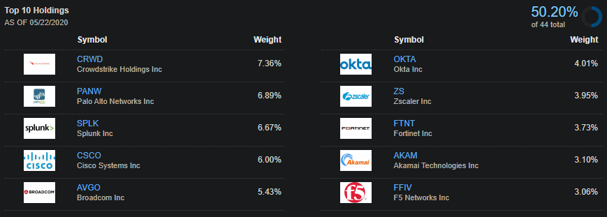
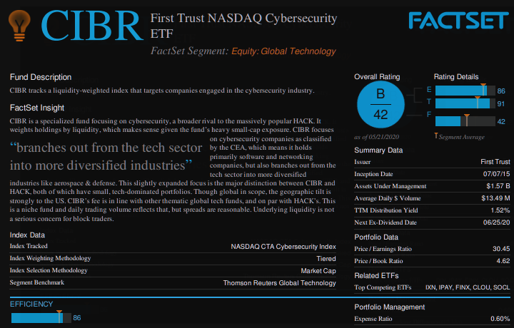
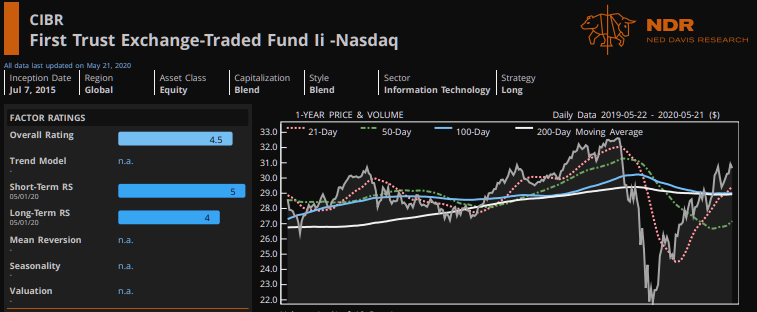
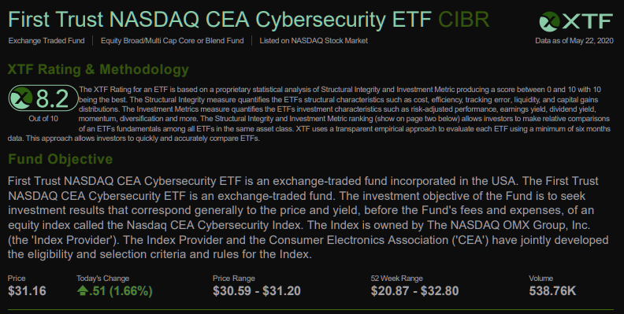
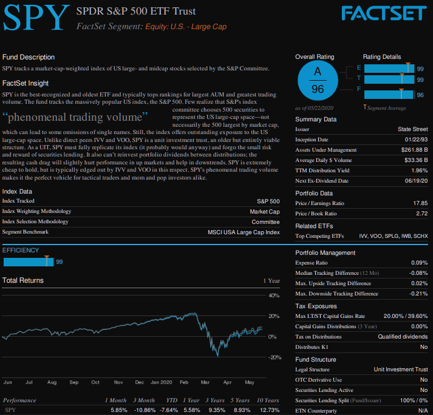
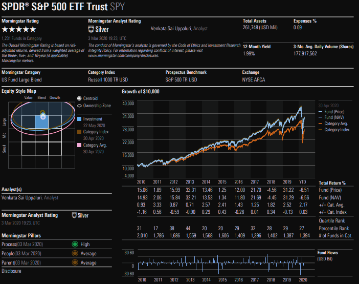
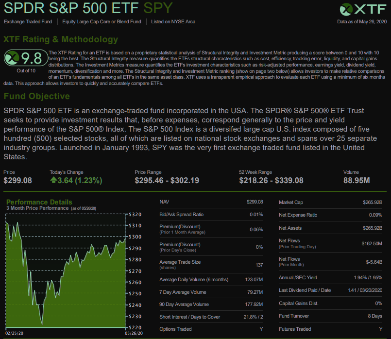

Operation: Elevator Ride to 30
=========================

[Gierael Ortega](https://linkedin.com/in/gieraelortega)'s plan regarding long-term investing in the midst of the COVID-19 pandemic in Spring 2020. The "elevator ride to 30" is an analogy I made at the age of 21 for reaching a comfortable state of wealth by the age of 30. Current topics include:

  * Exchange-Traded Funds following Cybersecurity
  * Exchange-Traded Funds following the S&P 500
  * Diverse, Stable-growing Stocks

***

Exchange-Traded Funds following Cybersecurity
------------

> “It takes 20 years to build a reputation and few minutes of cyber-incident to ruin it.” - Stephane Nappo

With the ever-growing dependence on technology, cyber-attacks have been expanding in both occurrence and severity (especially with increasing demands in ransomware leading to additional funding for malicious actors). That being said, a long-term investor could potentially leverage this by investing via ETFs such as:

 1. [Global x Cybersecurity ETF ($BUG)](https://finance.yahoo.com/quote/BUG)
 2. [First Trust NASDAQ Cybersecurity ETF ($CIBR)](https://finance.yahoo.com/quote/CIBR)
 3. [ETFMG Prime Cyber Security ETF ($HACK)](https://finance.yahoo.com/quote/HACK)
 4. [ISHARES Cybersecurity and Tech ETF ($IHAK)](https://finance.yahoo.com/quote/IHAK)

### **My Plan So Far:** Gradually purchase $CIBR (Currently between $30-$32) and hold long-term ###

- **Top 10 Holdings:**

- **FactSet Analysis Rating:** "B" ("A" thru "F")

- **Ned Davis Research Group Analysis Rating:** 4.5/5.0

- **XTF Analysis Rating:** 8.2/10

***

Exchange-Traded Funds following the S&P 500
------------

The COVID-19 pandemic has caused a drastic dip in all markets across the globe. Despite this, the S&P 500 has already begun climbing up towards pre-virus levels as the world starts to "reopen". Even if a "second wave" of the virus occurs, we may be near the levels worth investing in ETFs that track the S&P 500 such as the [SPDR S&P 500 ETF TRUST ($SPY)](https://finance.yahoo.com/quote/SPY).

### **My Plan So Far:** Gradually purchase $SPY (Currently between $295-$305) and hold long-term ###

- **FactSet Analysis Rating:** "A" ("A" thru "F")

- **MorningStar Analysis Rating:** 5/5

- **XTF Analysis Rating:** 9.8/10

***

Relatively Stable Stocks with a Dividend Payout
------------

In addition to investing in ETFs, I plan to diversify my portfolio with the purchase of companies in various sectors with a history of consistent growth and dividends. Since I intend to hold onto my investments for many years (>7 years), capitalizing on these stocks may prove to be lucrative as they continue to recover and grow. Potential prospects include:

 1. [REALTY INCOME CORP ($O)](https://finance.yahoo.com/quote/O)
 2. [Microsoft ($MSFT)](https://finance.yahoo.com/quote/MSFT)
 3. [Coca-Cola Company ($KO)](https://finance.yahoo.com/quote/KO)
 4. [Johnson & Johnson ($JNJ)](https://finance.yahoo.com/quote/JNJ)
 5. [AT&T ($T)](https://finance.yahoo.com/quote/T)

### **My Plan So Far:**
- Gradually purchase $O (Currently between $54-$56)  
  (Real Estate)  

- Gradually purchase $MSFT (Currently between $175-$185)  
  (Technology)  

- Gradually purchase $KO (Currently between $44-$47)  
  (Beverage)  

- Gradually purchase $JNJ (Currently between $142-$152)  
  (Medical/Pharmaceutical/Consumer Goods)  

- Gradually purchase $T (Currently between $30-$32)  
  (Phone Provider)  

***

This document has been created by [Gierael Ortega](https://linkedin.com/in/gieraelortega) for personal planning/usage. This is NOT professional and I do not take any responsibility for any losses.
